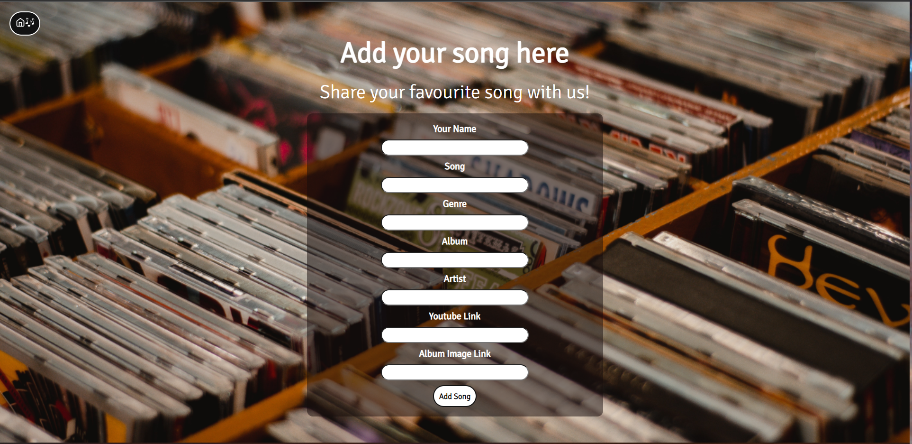

# Full Stack Project App - Nologyfy

This project is created using React. Here's a link to the live site:

- https://j-jinjia.github.io/full-stack-project/

The aims of this project were to practice React fundamentals(React components, props, functions as props) as well using SpringBoot, Java , MySQL and GCP(Google Cloud Platform) to create a full stack project.

# ABOUT

This music app was created using:

- Functinality and Layout: JSX and SASS (SCSS, and BEM notation)
  -Backend server: SpringBoot, Java, MySQL and Google Cloud Platform

It has a responsive design for:

- Mobile devices and tablets up to 768px
- Tablets and small laptops up to 1024px
- Pc monitors and larger devices from 1024px

# Functionality

This website can be navigated as follows:

- Wait for the data to be fetched from the server
- Click on each image to see more information about the song
- Inside each image, there's a youtube video with information about the song.
- Click on the add button to add a song of your own.

# Features

In this website you can:

- Add a song to the website
- Delete a song from the website
- Search for an artist within the website
- Reproduce a youtube video with custom controls.

# Preview

# Improvements

- Organize songs in home page by genre
- Improve custom controls on youtube video preview.
- Be able to search by artist, song or genre. (Currently only artist)
- Add filters by genre, release date.
- General code refactor
